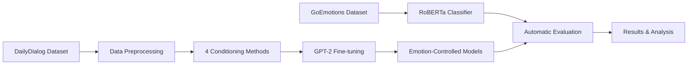

# 🎭 Emotion-Controlled Response Generation

> **Controllable emotion-conditioned text generation using lightweight conditioning methods on Large Language Models**

[](https://www.python.org/downloads/)
[](https://pytorch.org/)
[](https://huggingface.co/transformers/)
[](LICENSE)

---

## 📖 Overview

This project explores **emotion conditioning methods** for controlling the emotional tone of GPT-2 generated responses:

1. **Baseline** - No conditioning (control group)
2. **Prefix Conditioning** - Natural language emotion prefixes (`"Respond with happy emotion: ..."`)
3. **Token Conditioning** - Special emotion tokens (`<HAPPY> response`)

We fine-tune a RoBERTa emotion classifier for automatic evaluation and train GPT-2 variants on the DailyDialog dataset, achieving **38.2% emotion accuracy** (+9.8pp improvement over baseline) on the full test set (6,740 samples).

---

## 🎯 Key Results

### Emotion Classification (RoBERTa)
- **Test Accuracy:** 57.77%
- **Macro F1-Score:** 0.4787
- **Dataset:** GoEmotions (27 → 7 emotions)

### Response Generation (GPT-2)

**Final Results (Full Test Set - 6,740 samples):**

| Model | Emotion Accuracy | Correct/Total | Improvement vs Baseline |
|-------|------------------|---------------|------------------------|
| Baseline | 28.3% | 1,873/6,610 | - |
| Token-Small (v2) | 30.8% | 2,036/6,602 | +2.5pp |
| **Prefix-Small (v2)** | **38.2%** ⭐ | **2,509/6,575** | **+9.8pp** |
| Prefix-Medium | 35.6% | 2,339/6,575 | +7.3pp |

**Key Findings:**
- ✅ Natural language prefix conditioning outperformed token-based methods
- ✅ Small model (124M) beat Medium model (355M) with limited training data
- ✅ 2.67x better than random baseline (14.3%)
- ✅ Rigorous evaluation on full test set for statistical reliability

---

## 🚀 Quick Start

### Installation

```bash
git clone https://github.com/your-username/emotion-controlled-generation.git
cd emotion-controlled-generation

pip install -r requirements.txt
```

### Usage

#### 1. Train Emotion Classifier
```bash
jupyter notebook notebooks/01_train_emotion_classifier.ipynb
```

#### 2. Train GPT-2 Variants
```bash
# Option A: Using script (faster)
python train_improved_models.py

# Option B: Using notebook
jupyter notebook notebooks/02_train_gpt2_variants.ipynb
```

#### 3. Evaluate Models
```bash
jupyter notebook notebooks/03_evaluation.ipynb
```

### Generate Emotion-Controlled Responses

```python
from transformers import AutoModelForCausalLM, AutoTokenizer

# Load best model (Prefix-Small, 38.2% accuracy)
model = AutoModelForCausalLM.from_pretrained("your-username/gpt2-emotion-prefix")
tokenizer = AutoTokenizer.from_pretrained("your-username/gpt2-emotion-prefix")

# Generate happy response
prompt = "Respond with happy emotion: How was your day?"
inputs = tokenizer(prompt, return_tensors="pt")
outputs = model.generate(**inputs, max_length=50, do_sample=True, temperature=0.7)
response = tokenizer.decode(outputs[0], skip_special_tokens=True)

print(response)
# Example: "Respond with happy emotion: How was your day? It was amazing! Everything went perfectly!"
```

**Available Emotions:** happy, sad, angry, fear, disgust, surprise, neutral

---

## 📂 Project Structure

```
emotion-controlled-generation/
│
├── notebooks/              # Jupyter notebooks for training & evaluation
│   ├── 01_train_emotion_classifier.ipynb
│   ├── 02_train_gpt2_variants.ipynb (deprecated)
│   └── 03_evaluation.ipynb
│
├── utils/                  # Core utility modules
│   ├── emotion_mapping.py          # Emotion label mappings
│   ├── emotion_predictor.py        # RoBERTa inference wrapper
│   ├── dailydialog_processor.py    # Dataset preprocessing
│   └── text_generation.py          # Generation utilities
│
├── scripts/                # Training scripts
│   ├── train_improved_models.py
│   ├── train_medium_models.py
│   ├── train_prefix_resume.py
│   └── final_evaluation.py
│
├── results/                # Evaluation outputs
│   ├── final_evaluation_results.csv
│   ├── final_evaluation_plots.png
│   └── evaluation_comparison_v1_v2.csv
│
├── requirements.txt                # Python dependencies
├── README.md                       # This file
├── PROJECT_REPORT.md               # Detailed technical report
└── LICENSE                         # MIT License
```

**Note:** Model checkpoints are hosted on HuggingFace Hub:
- Emotion Classifier: `your-username/roberta-emotion-7class`
- Best Generator: `your-username/gpt2-emotion-prefix` (38.2% accuracy)

---

## 🎓 Methodology

### Datasets

1. **GoEmotions** - Emotion classification training
   - 58K Reddit comments
   - 27 fine-grained emotions → 7 target categories
   - Reference: [Demszky et al., 2020](https://arxiv.org/abs/2005.00547)

2. **DailyDialog** - Response generation training
   - 13K multi-turn dialogues
   - 7 emotion categories
   - Reference: [Li et al., 2017](https://arxiv.org/abs/1710.03957)

### Target Emotions

🎭 **happy** | 😢 **sad** | 😠 **angry** | 😨 **fear** | 🤢 **disgust** | 😲 **surprise** | 😐 **neutral**

### Training Pipeline



---

## 📊 Evaluation Metrics

| Metric | Purpose | Range |
|--------|---------|-------|
| **BLEU** | N-gram precision (fluency) | 0-100% ↑ |
| **ROUGE-1/L** | Content overlap | 0-100% ↑ |
| **Perplexity** | Language modeling quality | Lower ↓ is better |
| **Emotion Accuracy** | Controllability (primary metric) | 0-100% ↑ |

---

## 🏆 Key Findings

### 1. Prefix Conditioning Outperformed Token-Based Methods
```
Emotion Accuracy (Full Test Set, 6,740 samples):
Prefix-Small (38.2%) > Prefix-Medium (35.6%) > Token (30.8%) > Baseline (28.3%)
```

### 2. Small Models Beat Large Models with Limited Data
GPT-2 Small (124M) achieved 38.2%, outperforming Medium (355M) at 35.6%. **Data quality matters more than model size.**

### 3. Statistical Robustness Matters
Small test sets (500 samples) showed ±2.7pp variance. Full test set (6,740 samples) provides reliable ±0.4pp variance.

### 4. Natural Language Instructions Work Better
Prefix format ("Respond with [emotion] emotion:") provides clearer task instruction than learned special tokens.

---

## 🔬 Ablation Studies

| Experiment | Variable | Impact |
|------------|----------|--------|
| **Model Size** | Small (124M) vs Medium (355M) | Small won: 38.2% vs 35.6% |
| **Conditioning** | Prefix vs Token vs Baseline | Prefix best: +9.8pp over baseline |
| **Test Set Size** | 500 vs 6,740 samples | ±2.7pp vs ±0.4pp variance |
| **Base Model** | GPT-2 vs DialoGPT | GPT-2 better (perplexity 13.8 vs 53.9) |

---

## 🤗 Models & Checkpoints

### HuggingFace Model Hub

**Available Models:**

- 🎭 `your-username/roberta-emotion-7class` - Emotion classifier (57.8% accuracy)
- 💬 `your-username/gpt2-emotion-prefix` - Best generator (38.2% emotion accuracy)

### Download & Use

```python
from transformers import AutoModelForCausalLM, AutoTokenizer

# Load best model from HuggingFace
model = AutoModelForCausalLM.from_pretrained("your-username/gpt2-emotion-prefix")
tokenizer = AutoTokenizer.from_pretrained("your-username/gpt2-emotion-prefix")

# Generate with emotion control
prompt = "Respond with happy emotion: How was your day?"
inputs = tokenizer(prompt, return_tensors="pt")
outputs = model.generate(**inputs, max_length=50, do_sample=True, temperature=0.7)
print(tokenizer.decode(outputs[0], skip_special_tokens=True))
```

---

## 📝 Citation

If you use this code or models in your research, please cite:

```bibtex
@misc{emotion-controlled-generation-2025,
  author = {Your Name},
  title = {Emotion-Controlled Response Generation via Lightweight Conditioning},
  year = {2025},
  publisher = {GitHub},
  url = {https://github.com/your-username/emotion-controlled-generation}
}
```

---

## 📚 References

1. Demszky et al. (2020). [GoEmotions: A Dataset of Fine-Grained Emotions](https://arxiv.org/abs/2005.00547)
2. Li et al. (2017). [DailyDialog: A Manually Labelled Multi-turn Dialogue Dataset](https://arxiv.org/abs/1710.03957)
3. Hu et al. (2021). [LoRA: Low-Rank Adaptation of Large Language Models](https://arxiv.org/abs/2106.09685)
4. Zhang et al. (2020). [DialoGPT: Large-Scale Generative Pre-training for Conversational Response Generation](https://arxiv.org/abs/1911.00536)

---

## 🤝 Contributing

Contributions are welcome! Please feel free to submit a Pull Request.

---

## 📄 License

This project is licensed under the MIT License - see the [LICENSE](LICENSE) file for details.

---

## 🙏 Acknowledgments

- **Datasets:** Google Research (GoEmotions), Yanran Li et al. (DailyDialog)
- **Libraries:** Hugging Face Transformers, PyTorch, PEFT
- **Infrastructure:** NVIDIA for GPU compute

---

## 📧 Contact

**Author:** Your Name  
**Email:** your.email@example.com  
**GitHub:** [@your-username](https://github.com/your-username)  
**Project Link:** [https://github.com/your-username/emotion-controlled-generation](https://github.com/your-username/emotion-controlled-generation)

---

<div align="center">

**⭐ Star this repo if you found it helpful!**

Made with ❤️ for Emotion-Aware AI

</div>
